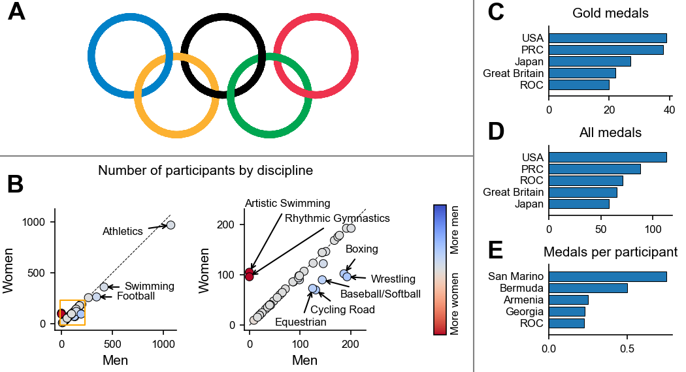

# Making multipanel figures with Matplotlib, quick and easy

Viktor Sip, 2021

Short tutorial on making publication-ready multipanel figures with Matplotlib. The Jupyter notebook will guide you how to create the figure below:

## License

- The text and code was written by Viktor Sip. The code is shared under [MIT License](LICENSE), and the non-code is shared under [CC BY 4.0 License](https://creativecommons.org/licenses/by/4.0/). 
- The dataset (`data/`) was created by [Arjun Prasad Sarkhel](https://www.kaggle.com/arjunprasadsarkhel) and is shared under [CC BY-SA 4.0 License](https://creativecommons.org/licenses/by-sa/4.0/). [Source on kaggle.com](https://www.kaggle.com/arjunprasadsarkhel/2021-olympics-in-tokyo).
 
